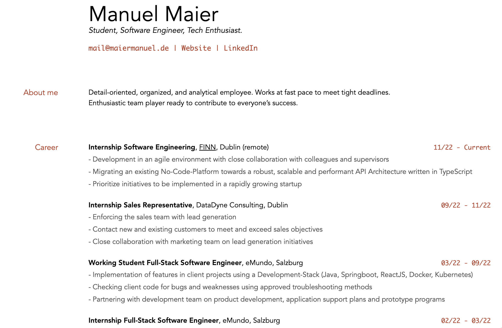

# My CV in Markdown

Hi, this is the Repo where I store my Curriculum Vitae.

After years of fiddling around with .docx-files or resume builders which are very costly I decided that I wanted:

1. a single source of truth for my CV
2. an easy way to edit my CV 
3. an even easier way to publish my CV as a webpage with the possibility of exporting it to pdf when needed.

After some research I stumbled across the awesome Repo [markdown-cv](https://github.com/elipapa/markdown-cv) which promised to tick all the boxes. 

So I forked the Repo, got to work and indeed, after a very short time I got a modern and sleek looking result, which gets published as an Webpage after each commit thanks to Github Pages automations.
Via CSS-Media-Queries I'm even able to print a PDF directly from the webbrowser in the styling I want it to be! 

Please check out my CV [here](https://cv.manuelmaier.site) or check out other [links of mine](https://me.maiermanuel.website)
